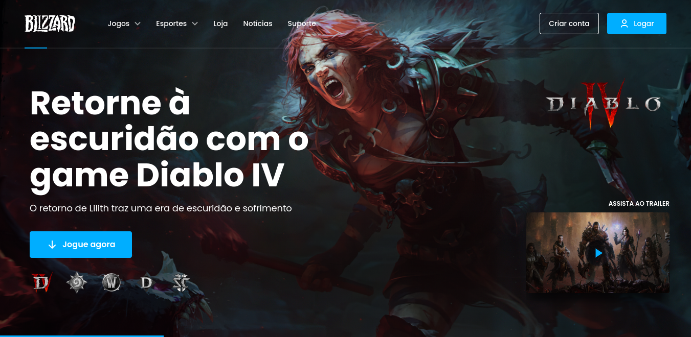

<h1 align="center"> Blizzard Site </h1>

  Segundo desafio da plataforma BRChallenges que consistia em criar um site clone da empresa Blizzard.

  <a href="#-tecnologias">Tecnologias</a>&nbsp;&nbsp;&nbsp;|&nbsp;&nbsp;&nbsp;
  <a href="#-projeto">Projeto</a>&nbsp;&nbsp;&nbsp;|&nbsp;&nbsp;&nbsp;
  <a href="#-deploy">Deploy</a>&nbsp;&nbsp;&nbsp;|&nbsp;&nbsp;&nbsp;
  <a href="#-layout">Layout</a>&nbsp;&nbsp;&nbsp;|&nbsp;&nbsp;&nbsp;
  <a href="#memo-licença">Licença</a>

  

 

  

## 🚀 Tecnologias

Esse projeto foi desenvolvido com as seguintes tecnologias:

- JavaScript e JSON
- [Node e NPM](https://nodejs.org/)
- [Vite](https://vitejs.dev/)
- [React](https://reactjs.org/)
- API do desafio

## 💻 Projeto

O Blizzard Site é um projeto clone do próprio site da empresa [Blizzard](https://www.blizzard.com/pt-br/), contendo os principais jogos que são retornados a partir da API do desafio, totalmente responsivo em todas as telas, terminei esse projeto no nível médio, então falta algumas coisas para ficar completo.

## ✈️ Deploy

Hospedado na Netlify. [Aqui o link!](https://poveii-blizzard-site.netlify.app/)

## 🔖 Layout

Você pode visualizar o layout do projeto através [DESSE LINK](https://www.figma.com/file/mlAXZPRMfibrGXkJmUz5yn/BR-Challenges/duplicate). É necessário ter conta no [Figma](https://figma.com) para acessá-lo.

## :memo: Licença

Esse projeto está sob a licença MIT.

---

Feito com ⚡ by Poveii
